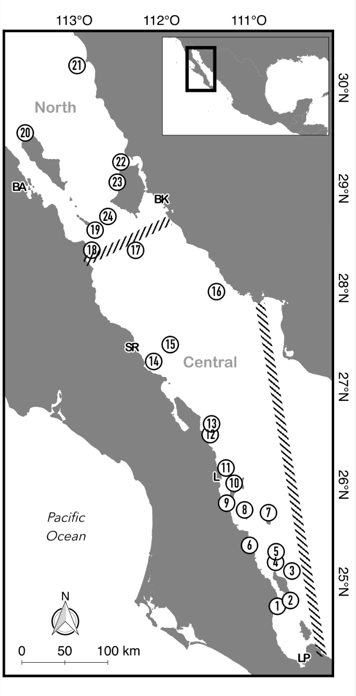

Los datos que usaremos durante el curso provienen de un estudio de ADN ambiental (eDNA) diseñado para evaluar la biodiversidad de peces en el Golfo de California mediante metabarcoding.

El estudio fue publicado en:

> Valdivia-Carrillo T, Rocha-Olivares A, Reyes-Bonilla H, Domínguez-Contreras JF, Munguia-Vega A. (2021). Integrating eDNA metabarcoding and simultaneous underwater visual surveys to describe complex fish communities in a marine biodiversity hotspot. *Molecular Ecology Resources*, 21(5), 1558–1574. [DOI: 10.1111/1755-0998.13375](https://doi.org/10.1111/1755-0998.13375)

---

## Contexto del estudio

La biodiversidad marina puede evaluarse mediante censos visuales subacuáticos (UVC) y, más recientemente, con metabarcoding de eDNA. Aunque el eDNA es una herramienta prometedora, su escala de detección y el número de especies identificadas pueden variar con respecto a otros métodos de muestreo. Además, la precisión de la asignación taxonómica depende de contar con bases de datos de referencia completas.

En este estudio se compararon los resultados de censos visuales subacuáticos y muestreos simultáneos de eDNA para evaluar comunidades de peces, analizando las especies observadas y la composición de comunidades con ambos métodos.

---

## Diseño de muestreo

{width=50%}

- **Región**: Golfo de California, México
- **Sitios de muestreo**: 24 localidades distribuidas a lo largo del Golfo, cubriendo las regiones Norte, Central y Sur
- **Tipo de muestra**: agua de mar (ADN ambiental)
- **Marcador molecular**: 12S rRNA (código de barras para peces)
- **Longitud del amplicón**: ~65 bp (sin primers)
- **Plataforma de secuenciación**: Illumina MiSeq (lecturas paired-end 2×150 bp)

---

## Principales hallazgos

- Se detectaron **más especies con eDNA** que con censos visuales subacuáticos
- Cada método detectó conjuntos diferentes de especies — combinados, **duplicaron** el número de especies registradas
- Ambos métodos recuperaron un **gradiente de biodiversidad conocido** y una ruptura biogeográfica en el Golfo
- El eDNA capturó diversidad en una **escala geográfica y batimétrica más amplia**
- El uso de una **base de datos de referencia personalizada** incrementó significativamente la asignación taxonómica
- Los modelos de ocupación revelaron que el eDNA proporcionó probabilidades de detección **similares o superiores** a los censos visuales

---

## ¿Qué vamos a analizar en el curso?

Trabajaremos con un subconjunto de los datos de este estudio: muestras de agua filtradas en campo, cuyo ADN fue extraído, amplificado con primers para el marcador **12S** y secuenciado en Illumina MiSeq.

A lo largo del curso procesaremos estos datos desde los archivos FASTQ crudos hasta obtener una tabla de ASVs con asignación taxonómica y análisis de diversidad ecológica — replicando el flujo de trabajo bioinformático del estudio original.

::: {.callout-tip icon="false"}
**¿Por qué 12S?** El marcador 12S rRNA es uno de los más utilizados para metabarcoding de peces porque produce amplicones cortos (~65 bp) que se amplifican bien a partir de ADN degradado como el que encontramos en muestras ambientales. Su corta longitud permite un solapamiento completo de las lecturas paired-end y una alta tasa de recuperación.
:::
