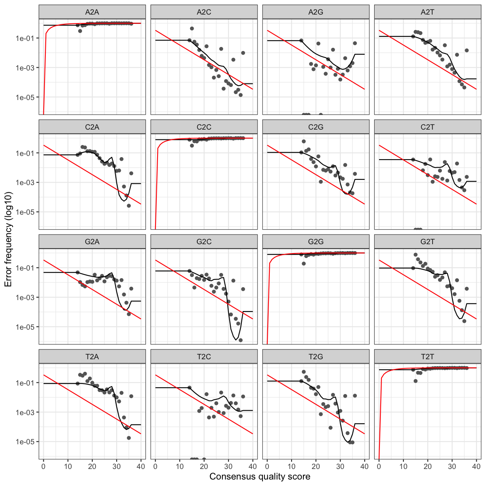

Este paso tiene dos partes: primero **dereplicamos** las lecturas (agrupamos duplicados y contamos abundancias), luego **aprendemos el modelo de error** específico de nuestro run para poder separar errores técnicos de variantes biológicas reales. El resultado es el conjunto de ASVs: secuencias verificadas a resolución de nucleótido único.

---

## Configuración del entorno

```{r eval=FALSE}
library(dada2,     quietly = TRUE)
library(tidyverse, quietly = TRUE)
library(ShortRead)

set.seed(42)
```

Carga el checkpoint guardado al final del filtrado de calidad:

```{r eval=FALSE}
setwd("~/metabarcoding-code")

output_location   <- "final_data"
metadata_location <- "metadata"
primer_csv        <- file.path(metadata_location, "primer_data.csv")
primer.data       <- readr::read_csv(primer_csv, show_col_types = FALSE)
i                 <- 1

checkpoint_derep <- list.files(file.path(output_location, "rdata_output"),
                               pattern = "Dereps\\.RData$", full.names = TRUE)
load(checkpoint_derep)
message("Checkpoint cargado: ", basename(checkpoint_derep))
```

---

## Paso 1 — Dereplicación

**Qué hace:** agrupa todas las lecturas con exactamente la misma secuencia en una sola entrada y registra cuántas veces apareció cada una (su **abundancia**). Esto reduce el volumen de datos drásticamente — en nuestros datos, de ~158,000 lecturas a ~6,000 secuencias únicas — sin perder ninguna información biológica. Los pasos siguientes trabajan con esas secuencias únicas, no con todas las lecturas repetidas.

```{r eval=FALSE}
exists <- file.exists(filtFs) & file.exists(filtRs)
filtFs <- filtFs[exists]
filtRs <- filtRs[exists]
sample.names <- sample.names[exists]

derepFs <- derepFastq(filtFs, verbose = TRUE)
derepRs <- derepFastq(filtRs, verbose = TRUE)
names(derepFs) <- sample.names
names(derepRs) <- sample.names
```

**Qué chequear:** el diagnóstico de la primera muestra muestra cuántas secuencias únicas hay y cuál es el ratio de compresión:

```{r eval=FALSE}
n_unique_F     <- length(derepFs[[1]]$uniques)
total_reads_F  <- sum(derepFs[[1]]$uniques)
compression_ratio <- round(n_unique_F / total_reads_F * 100, 2)

message("Secuencias únicas Forward: ", n_unique_F)
message("Ratio de compresión: ", compression_ratio, "%")
message("Top 5 abundancias: ", paste(head(sort(derepFs[[1]]$uniques, decreasing = TRUE), 5), collapse = ", "))

if (compression_ratio < 1)
  message("INFO: Baja diversidad (< 1% únicas). Normal en muestras con especies dominantes.")
if (compression_ratio > 50)
  warning("Alta diversidad inusual (> 50% únicas). Revisa calidad del filtrado o contaminación.")
```

| Ratio de compresión | Interpretación |
|---|---|
| < 1% | Muy pocas secuencias únicas — muestra dominada por pocas especies |
| 1–10% | Rango típico para eDNA |
| 10–30% | Alta diversidad o amplicones largos |
| > 50% | Inusual — posible contaminación o baja calidad de filtrado |

::: {.callout-note icon="false"}
La mayoría de las secuencias únicas con pocas lecturas (1–5) son probablemente **errores de secuenciación**, no especies reales. El modelado de errores del paso siguiente se encargará de distinguirlas.
:::

El pipeline guarda estadísticas de dereplicación para todas las muestras en `final_data/logs/`:

```{r eval=FALSE}
derep_stats <- data.frame(
  Sample        = sample.names,
  Unique_seqs_F = sapply(derepFs, function(x) length(x$uniques)),
  Total_reads_F = sapply(derepFs, function(x) sum(x$uniques)),
  Unique_seqs_R = sapply(derepRs, function(x) length(x$uniques)),
  Total_reads_R = sapply(derepRs, function(x) sum(x$uniques))
)
derep_stats$Compression_ratio_F <- with(derep_stats,
  round(Unique_seqs_F / Total_reads_F * 100, 2))
derep_stats$Compression_ratio_R <- with(derep_stats,
  round(Unique_seqs_R / Total_reads_R * 100, 2))

write.csv(derep_stats,
  file.path(output_location, "logs",
            paste0(run_name, "_", primer.data$locus_shorthand[i], "_derep_stats.csv")),
  row.names = FALSE)
```

## Checkpoint — después de dereplicación

```{r eval=FALSE}
save(out, filtFs, filtRs, fnFs, fnRs, sample.names, primer.data, run_name,
     fastq_location, output_location, metadata_location,
     where_trim_all_Fs, where_trim_all_Rs,
     derepFs, derepRs, n_unique_F, total_reads_F, compression_ratio,
     file = file.path(output_location, "rdata_output",
                      paste0(run_name, "_", primer.data$locus_shorthand[i], "_checkpoint2_Dereps.RData")))
message("Checkpoint 2 guardado (Dereps)")
```

---

## Paso 2 — Aprender el modelo de error

**Qué hace:** estima las tasas de error específicas de **tu** run de secuenciación. La secuenciadora Illumina comete errores que dependen del tipo de cambio de base (A→C, A→G, etc.) y del Q-score de cada posición. `learnErrors()` aprende estas tasas directamente de tus datos — iterando hasta que las estimaciones estabilicen — para no usar valores genéricos que no reflejan el perfil real de tu equipo y reactivos.

**¿Cómo construye la tabla de tasas?**

Imagina que tienes esta lectura:

```
Secuencia real:  A T G C A T G
Secuencia leída: A T G C C T G
                             ↑
                        error — leyó C en vez de A
```

La secuenciadora asigna un Q-score a esa posición — digamos Q20. Eso significa 1% de probabilidad de error. DADA2 registra ese evento: *"con Q20, vi un cambio A→C"*.

Después de millones de bases, cuenta todos esos eventos:

```
A→C con Q20: ocurrió 500 veces de 50,000 posiciones = 1%
A→C con Q30: ocurrió 50 veces de 50,000 posiciones  = 0.1%
A→C con Q40: ocurrió 5 veces de 50,000 posiciones   = 0.01%
```

Hace eso para los 12 cambios posibles (A→C, A→G, A→T, C→A, C→G, C→T, G→A, G→C, G→T, T→A, T→C, T→G) y para cada nivel Q0–Q40. El resultado es la tabla que ves en `plotErrors` — 16 paneles, uno por cada combinación incluyendo A→A, C→C, etc.

**El problema del huevo y la gallina**

Para contar cuántas veces ocurrió A→C necesitas saber cuál era la base real — pero no la sabes, solo tienes lo que leyó la secuenciadora. ¿El A→C que observas es un error (la base real era A) o una variante real (la base realmente es C en ese organismo)? No puedes saberlo sin el modelo de error, y no puedes tener el modelo sin saberlo. DADA2 lo resuelve iterando:

- **Ronda 0:** asume que TODO es error. Calcula las tasas iniciales con esa suposición
- **Ronda 1:** con esas tasas evalúa cada secuencia — las muy abundantes probablemente son reales, las separa. Recalcula las tasas usando solo lo que considera errores
- **Rondas siguientes:** repite. Cada vez la separación es más precisa y las tasas más confiables
- **Convergencia:** cuando las tasas de la ronda N y N+1 son prácticamente idénticas, el modelo dejó de cambiar

En nuestros datos Forward convergió en 9 rondas, Reverse en 14 — Reverse tarda más porque sus lecturas tienen mayor tasa de error y el modelo necesita más iteraciones para estabilizarse.

Antes de lanzarlo, el pipeline valida que haya suficientes datos:

```{r eval=FALSE}
nbases_target <- 1e8   # 100 millones de bases (aumentar si tienes > 50 muestras)
max_consist   <- 25    # más iteraciones que el default (10) para forzar convergencia

# Validar datos disponibles
total_bases_F <- sum(sapply(filtFs, function(f) if (file.exists(f)) file.info(f)$size else 0))
total_bases_R <- sum(sapply(filtRs, function(r) if (file.exists(r)) file.info(r)$size else 0))
message("Forward disponible: ~", round(total_bases_F / 1e6, 1), " MB")
message("Reverse disponible: ~", round(total_bases_R / 1e6, 1), " MB")

if (total_bases_F < 1e6 || total_bases_R < 1e6)
  warning("Datos muy limitados (< 1 MB). El modelo puede ser inestable.")
```

`tryCatch()` es un envoltorio de seguridad: ejecuta el código dentro y, si ocurre un error, lo captura y muestra un mensaje claro en lugar de que R falle silenciosamente. Aquí lo usamos porque `learnErrors()` puede tardar varios minutos — si falla a mitad, queremos saber exactamente por qué.

```{r eval=FALSE}
errF <- tryCatch({
  learnErrors(filtFs, nbases = nbases_target, randomize = TRUE,
              multithread = 2, MAX_CONSIST = max_consist, verbose = TRUE)
}, error = function(e) {
  stop("Error al aprender modelo Forward: ", conditionMessage(e))
})

errR <- tryCatch({
  learnErrors(filtRs, nbases = nbases_target, randomize = TRUE,
              multithread = 2, MAX_CONSIST = max_consist, verbose = TRUE)
}, error = function(e) {
  stop("Error al aprender modelo Reverse: ", conditionMessage(e))
})
```

**Parámetros clave:**

| Parámetro | Valor | Qué hace |
|---|---|---|
| `nbases` | `1e8` | Bases a usar para aprender el modelo. DADA2 toma muestras hasta alcanzar ese total |
| `randomize` | `TRUE` | Selecciona lecturas al azar — produce un modelo más representativo |
| `multithread` | `2` | Núcleos a usar (limitado a 2 por el servidor compartido) |
| `MAX_CONSIST` | `25` | Iteraciones máximas. El default es 10; 25 garantiza convergencia en datos complejos |

**Qué chequear en la salida:**

```
103158594 total bases in 1637438 reads from 20 samples will be used for learning the error rates.
selfConsist step 1 ..........
   selfConsist step 2
   ...
Convergence after  12  rounds.
```

- **Número de bases y muestras usadas** — confirma que DADA2 alcanzó `nbases_target`
- **Convergencia** — cuántas rondas tardó en estabilizar las estimaciones

| Rondas hasta convergencia | Interpretación |
|---|---|
| 3–5 | Convergencia rápida — datos de buena calidad |
| 5–15 | Rango típico |
| 15–25 | Datos complejos o ruidosos — el modelo es válido |
| No converge (llega a MAX_CONSIST) | Aumenta `MAX_CONSIST` a 50 o revisa la calidad del filtrado |

Después del aprendizaje, el pipeline valida que las tasas estimadas sean razonables:

```{r eval=FALSE}
# Validar modelo Forward
if (!is.null(errF$err_out)) {
  rn         <- rownames(errF$err_out)
  error_rows <- rn[substr(rn, 1, 1) != substr(rn, 3, 3)]   # A2C, A2G, etc.
  q_cols     <- as.integer(colnames(errF$err_out))
  hq_cols    <- which(q_cols >= 20)                          # columnas Q≥20

  err_hq  <- errF$err_out[error_rows, hq_cols, drop = FALSE]
  max_err <- max(err_hq, na.rm = TRUE)

  message("Tipos de transición de error: ", length(error_rows), " (de 16 posibles)")
  message("Tasa de error máxima en Q≥20: ", round(max_err, 5),
          " (típico < 0.05; verifica con plotErrors() si > 0.10)")

  if (max_err > 0.1)
    message("Tasa de error > 10% en Q≥20. Verifica con plotErrors() que el modelo ajuste bien los datos.")
  else
    message("Modelo de error OK.")
}
```

| Tasa máxima en Q≥20 | Interpretación |
|---|---|
| < 1% | Excelente |
| 1–5% | Normal para Illumina |
| 5–10% | Marginal — revisa los gráficos |
| > 10% | Problemático — revisa calidad del run o el filtrado |

---

## Paso 3 — Visualizar el modelo de error

**Qué hace:** genera gráficas con las 16 posibles transiciones entre bases (A→A, A→C, A→G, ..., T→T). Permiten confirmar visualmente que el modelo aprendido es coherente con los datos.

```{r eval=FALSE}
png(file.path(output_location, "logs",
              paste0(run_name, "_", primer.data$locus_shorthand[i], "_errF.png")),
    width = 1200, height = 1200, res = 150)
print(plotErrors(errF, nominalQ = TRUE))
dev.off()

png(file.path(output_location, "logs",
              paste0(run_name, "_", primer.data$locus_shorthand[i], "_errR.png")),
    width = 1200, height = 1200, res = 150)
print(plotErrors(errR, nominalQ = TRUE))
dev.off()
```

{width=100%}

**Cómo leer la gráfica:**

- **Puntos grises** — tasas de error observadas en tus datos por Q-score
- **Línea negra** — el modelo ajustado por DADA2 (lo que usará en el denoising)
- **Línea roja** — tasa teórica nominal del Q-score (referencia ideal de Illumina)

**Un buen modelo:** la línea negra sigue los puntos grises, y ambas bajan de izquierda a derecha (a mayor Q-score, menos error). La línea negra no tiene que coincidir con la roja — cada run tiene su propio perfil real.

**Paneles diagonales (A→A, C→C, G→G, T→T):** lecturas correctas — aparecen vacíos o con muy pocos puntos porque la frecuencia de "error correcto" es prácticamente cero.

::: {.callout-note icon="false"}
Es normal que Reverse tenga tasas de error ligeramente más altas que Forward. Si Reverse se ve dramáticamente peor (línea plana, puntos muy dispersos), considera un truncamiento más agresivo en `filterAndTrim`.
:::

## Checkpoint — después de learnErrors

```{r eval=FALSE}
save(errF, errR, derepFs, derepRs, filtFs, filtRs, sample.names, primer.data, run_name, out,
     file = file.path(output_location, "rdata_output",
                      paste0(run_name, "_", primer.data$locus_shorthand[i],
                             "_checkpoint2_learnErrors.RData")))
message("Checkpoint 2 guardado (learnErrors)")
```

```{r eval=FALSE}
load(file.path(output_location, "rdata_output",
               paste0(run_name, "_", primer.data$locus_shorthand[i], "_checkpoint2_learnErrors.RData")))
```

---

## Paso 4 — Inferencia de ASVs con `dada()`

**Qué hace:** este es el paso central de DADA2. Toma las secuencias dereplicadas y el modelo de error aprendido, y determina cuáles secuencias únicas son **variantes biológicas reales** (ASVs) y cuáles son **errores de secuenciación**. Si la diferencia entre dos secuencias es consistente con un error según el modelo, las agrupa; si no puede explicarse como error, las mantiene separadas como ASVs distintas.

```{r eval=FALSE}
dadaFs <- dada(derepFs, err = errF, multithread = 2)
dadaRs <- dada(derepRs, err = errR, multithread = 2)
```

```{r eval=FALSE}
# Resumen de la primera muestra
dadaFs[[1]]
```

**Qué chequear:**

```
dada-class: object describing DADA2 denoising results
140 sequence variants were inferred from 6374 input unique sequences.
```

De 6,374 secuencias únicas (dereplicación), DADA2 determinó que solo **140 son variantes biológicas reales**. Las otras ~6,234 son errores de secuenciación colapsados de vuelta a su ASV de origen.

**¿Cómo decide cuál es real y cuál es error?** Para cada secuencia poco abundante calcula: *¿cuál es la probabilidad de ver esta secuencia por azar, solo por errores de secuenciación?* Si esa probabilidad es menor que `OMEGA_A = 1e-40` — es decir, es tan improbable que sea un error — la declara variante real aunque aparezca pocas veces. `1e-40` es un umbral extremadamente estricto (1 en 10⁴⁰), lo que hace que DADA2 sea muy conservador: prefiere perder una variante rara real antes que incluir un error.

| ASVs / secuencias únicas | Interpretación |
|---|---|
| < 5% | Normal para eDNA de peces con 12S — amplicón corto, pocas especies |
| 5–15% | Alta diversidad o amplicón más largo |
| > 50% | Inusual — revisa el modelo de error o la calidad del filtrado |

## Checkpoint — después de dada()

```{r eval=FALSE}
save(dadaFs, dadaRs, derepFs, derepRs, errF, errR, sample.names, primer.data, run_name, out,
     file = file.path(output_location, "rdata_output",
                      paste0(run_name, "_", primer.data$locus_shorthand[i],
                             "_checkpoint3_dada.RData")))
message("Checkpoint 3 guardado (dada)")
```

```{r eval=FALSE}
load(file.path(output_location, "rdata_output",
               paste0(run_name, "_", primer.data$locus_shorthand[i], "_checkpoint3_dada.RData")))
```

---

:::{.callout-tip}
## Para el curso
1. ¿Cuál es el ratio de compresión de la dereplicación en tu muestra? ¿Coincide con el rango esperado?
2. ¿En cuántas rondas convergió el modelo Forward? ¿Y Reverse?
3. Revisa `plotErrors()` — ¿la línea negra sigue los puntos grises en todos los paneles?
4. ¿Cuántas ASVs se infirieron en la primera muestra? ¿Qué porcentaje de las secuencias únicas representan?
:::

---

[→ Siguiente: DADA2 — Remoción de quimeras y seguimiento de lecturas](2-dada2QAQC-Chimeras.qmd){.btn .btn-primary}
