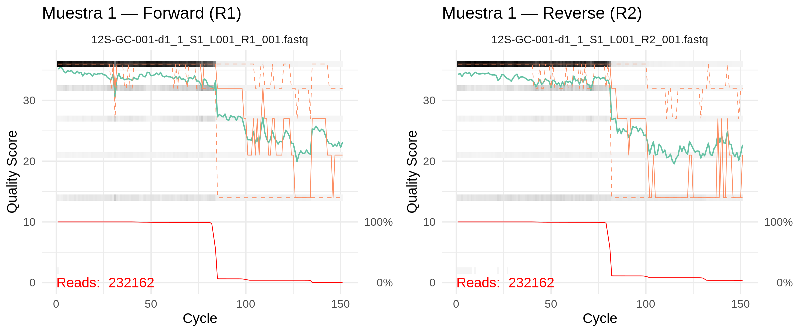

## Configuración del entorno

Antes de comenzar, abre R desde el directorio del proyecto:

```bash
cd ~/metabarcoding-code
R
```

Cargamos las librerías que usaremos a lo largo del pipeline:

```{r eval=FALSE}
library(dada2, quietly = TRUE)     # pipeline principal: ASVs, filtrado, errores, taxonomía
library(tidyverse, quietly = TRUE) # manipulación y visualización de datos
library(seqinr)                    # utilidades para secuencias FASTA
library(ShortRead)                 # lectura y QC de archivos FASTQ
library(fs)                        # operaciones con archivos y rutas
library(readr)                     # lectura/escritura de CSVs

set.seed(42)
```

Si no hay errores, todas las librerías están disponibles en el servidor.

---

## Definir rutas y parámetros

Definimos las rutas principales del proyecto. Todas son relativas a `~/metabarcoding-code/`, que es el directorio de trabajo.

```{r eval=FALSE}
setwd("~/metabarcoding-code")

fastq_location    <- "for_dada2"
output_location   <- "final_data"
metadata_location <- "metadata"
primer_csv        <- file.path(metadata_location, "primer_data.csv")

# Crear directorios de salida
dir.create(file.path(output_location, "logs"), recursive = TRUE, showWarnings = FALSE)
dir.create(file.path(output_location, "csv_output"), recursive = TRUE, showWarnings = FALSE)
dir.create(file.path(output_location, "rdata_output"), recursive = TRUE, showWarnings = FALSE)

i        <- 1          # fila de primer_data.csv a procesar
run_name <- format(Sys.time(), "%Y%m%d_%H%M")
```

- **`i`** selecciona qué locus procesar. Si tienes varios marcadores (ej. 12S y COI), cambia este valor para procesar cada uno
- **`run_name`** genera un prefijo único con la fecha y hora (ej. `20260325_1430`) para que cada corrida produzca archivos distintos y no se sobreescriban

---

## Leer parámetros del locus

El pipeline lee `primer_data.csv` para obtener la configuración específica del marcador: nombre del locus, longitud máxima de truncamiento, base de datos taxonómica, etc. Esto permite procesar diferentes marcadores con el mismo script, solo cambiando el valor de `i`.

```{r eval=FALSE}
primer_cols <- readr::read_csv(primer_csv, n_max = 0, show_col_types = FALSE) %>% names()

primer.data <- readr::read_csv(
  primer_csv,
  col_types = readr::cols(
    !!primer_cols[1] := readr::col_character(),
    !!primer_cols[2] := readr::col_character(),
    .default = readr::col_guess()
  )
)

primer.data
```

Verifica que la fila `i` corresponde al locus que quieres analizar. El pipeline usará `primer.data$locus_shorthand[i]`, `primer.data$db_name[i]`, etc. en todos los pasos siguientes.

---

## Localizar archivos FASTQ

El script busca en `for_dada2/` todos los archivos FASTQ que contengan el nombre del locus seleccionado. Separa las lecturas forward (R1) y reverse (R2), y extrae el identificador de muestra (`sample_id`) del nombre del archivo.

Por ejemplo, del archivo `12S-GC-001-d1_1_S1_L001_R1_001.fastq` extrae `GC-001` como identificador de muestra.

```{r eval=FALSE}
fnFs <- grep(primer.data$locus_shorthand[i],
             sort(list.files(fastq_location, pattern = "R1_001.fastq", full.names = TRUE)),
             value = TRUE)
fnRs <- grep(primer.data$locus_shorthand[i],
             sort(list.files(fastq_location, pattern = "R2_001.fastq", full.names = TRUE)),
             value = TRUE)

sample.names <- sub(
  paste0("^", primer.data$locus_shorthand[i], "-"), "",
  sub("-d[0-9]+$", "",
      sapply(strsplit(basename(fnFs), "_"), `[`, 1))
)

stopifnot(length(fnFs) == length(fnRs))
stopifnot(!any(duplicated(sample.names)))

length(fnFs)
head(sample.names)
```

Deberías ver el número total de muestras y los primeros nombres. Si el número no coincide con lo esperado, revisa que los archivos estén en `for_dada2/` y que el `locus_shorthand` en `primer_data.csv` sea correcto.

---

## Preparar rutas de archivos filtrados

Antes de filtrar, definimos dónde se guardarán los archivos filtrados (en `for_dada2/filtered/`) y eliminamos del análisis cualquier archivo vacío o corrupto que podría causar errores en pasos posteriores.

```{r eval=FALSE}
filtFs <- file.path(fastq_location, "filtered", paste0(sample.names, "_F_filt.fastq"))
filtRs <- file.path(fastq_location, "filtered", paste0(sample.names, "_R_filt.fastq"))
names(filtFs) <- sample.names
names(filtRs) <- sample.names

# Eliminar archivos vacíos o corruptos
file.empty   <- function(filenames) file.info(filenames)$size == 20
empty_files  <- file.empty(fnFs) | file.empty(fnRs)
fnFs         <- fnFs[!empty_files]
fnRs         <- fnRs[!empty_files]
filtFs       <- filtFs[!empty_files]
filtRs       <- filtRs[!empty_files]
sample.names <- sample.names[!empty_files]
```

---

## Inspección de calidad

Antes de decidir dónde truncar, visualizamos los perfiles de calidad. Estas gráficas muestran cómo varía la calidad Phred (Q) a lo largo de la lectura — típicamente la calidad es alta al inicio y decae hacia el final, especialmente en las lecturas reverse (R2).

Las gráficas se guardan como PNG porque en el servidor no hay pantalla gráfica:

```{r eval=FALSE}
# Gráfica 1: Forward (primeras 6 muestras)
png(filename = file.path(output_location, "logs",
              paste0(run_name, "_", primer.data$locus_shorthand[i], "_quality_forward.png")),
    width = 2400, height = 1600, res = 300)
plotQualityProfile(fnFs[seq_len(min(6, length(fnFs)))]) +
  ggplot2::theme_minimal(base_size = 10) +
  ggplot2::labs(title = "Perfiles de calidad — Forward (R1)")
dev.off()

# Gráfica 2: Reverse (primeras 6 muestras)
png(filename = file.path(output_location, "logs",
              paste0(run_name, "_", primer.data$locus_shorthand[i], "_quality_reverse.png")),
    width = 2400, height = 1600, res = 300)
plotQualityProfile(fnRs[seq_len(min(6, length(fnRs)))]) +
  ggplot2::theme_minimal(base_size = 10) +
  ggplot2::labs(title = "Perfiles de calidad — Reverse (R2)")
dev.off()

# Gráfica 3: Muestra 1 — Forward vs Reverse lado a lado
library(gridExtra)
p_f <- plotQualityProfile(fnFs[1]) +
  ggplot2::theme_minimal(base_size = 10) +
  ggplot2::labs(title = "Muestra 1 — Forward (R1)")
p_r <- plotQualityProfile(fnRs[1]) +
  ggplot2::theme_minimal(base_size = 10) +
  ggplot2::labs(title = "Muestra 1 — Reverse (R2)")

png(filename = file.path(output_location, "logs",
              paste0(run_name, "_", primer.data$locus_shorthand[i], "_quality_paired.png")),
    width = 2400, height = 1000, res = 300)
gridExtra::grid.arrange(p_f, p_r, ncol = 2)
dev.off()
```

Para descargar las gráficas a tu computadora:

```bash
scp usrXX@200.23.162.240:/home/usrXX/metabarcoding-code/final_data/logs/*quality*.png ~/Downloads/
```

Ejemplo de la gráfica paired (Muestra 1, Forward vs Reverse):



::: {.callout-tip icon="false"}
**Cómo leer las gráficas:**

- La **línea verde** es la mediana de calidad por posición
- La **zona gris** muestra los cuartiles (variabilidad entre lecturas)
- La **línea roja** (eje derecho) muestra el porcentaje de lecturas que llegan a esa posición — cuando cae a 0%, las lecturas ya terminaron
- Busca dónde la mediana cae por debajo de **Q30** — ese es el punto de truncamiento ideal
- Las lecturas R2 suelen degradar más rápido que R1; es normal que su punto de truncamiento sea menor
:::

---

## Distribución de longitudes de lecturas

Este diagnóstico permite detectar problemas de secuenciación como mezclas inesperadas de longitudes o lecturas truncadas prematuramente.

```{r eval=FALSE}
PLOT_RAW_LENGTHS <- TRUE  # cambiar a FALSE para saltar este paso

if (PLOT_RAW_LENGTHS) {
  sample_n_reads <- 100000
  get_lengths <- function(fq_file, n = sample_n_reads) {
    streamer <- ShortRead::FastqStreamer(fq_file, n = n)
    on.exit(close(streamer))
    chunk <- ShortRead::yield(streamer)
    if (length(chunk) == 0) return(integer(0))
    ShortRead::width(ShortRead::sread(chunk))
  }

  lengths_F <- purrr::map_df(fnFs, ~ tibble::tibble(
    ReadType = "Forward", File = basename(.x), Length = get_lengths(.x)))
  lengths_R <- purrr::map_df(fnRs, ~ tibble::tibble(
    ReadType = "Reverse", File = basename(.x), Length = get_lengths(.x)))
  lengths_all <- dplyr::bind_rows(lengths_F, lengths_R)

  png(file.path(output_location, "logs",
                paste0(run_name, "_", primer.data$locus_shorthand[i], "_raw_read_lengths.png")),
      width = 2000, height = 1200, res = 300)
  print(
    ggplot2::ggplot(lengths_all, ggplot2::aes(x = Length, fill = ReadType)) +
      ggplot2::geom_histogram(alpha = 0.6, position = "identity", binwidth = 1, color = "black") +
      ggplot2::facet_wrap(~ ReadType, ncol = 1, scales = "free_y") +
      ggplot2::scale_x_continuous(breaks = seq(0, max(lengths_all$Length, na.rm = TRUE), by = 10)) +
      ggplot2::labs(title = "Distribución de longitudes de lecturas crudas",
                    x = "Longitud (bp)", y = "Frecuencia") +
      ggplot2::theme_minimal() +
      ggplot2::theme(axis.text.x = ggplot2::element_text(angle = 90, vjust = 0.5, size = 7))
  )
  dev.off()
}
```

::: {.callout-tip icon="false"}
**¿Qué buscar en la gráfica?** Lo normal es ver un pico concentrado en una sola longitud (la longitud completa de la lectura). Si ves múltiples picos o una distribución muy dispersa, puede indicar problemas en la secuenciación o mezcla de librerías con diferentes longitudes.
:::

---

## Verificación de primers

Verificamos que los primers hayan sido removidos correctamente por Cutadapt. Si siguen presentes, DADA2 los interpretará como parte de la secuencia biológica y afectará el análisis.

```{r eval=FALSE}
library(Biostrings)

check_primers <- function(fastq_file, primer_seq, n = 1000) {
  streamer <- ShortRead::FastqStreamer(fastq_file, n = n)
  on.exit(close(streamer))
  chunk <- ShortRead::yield(streamer)
  seqs <- as.character(ShortRead::sread(chunk))
  exact_match <- sum(grepl(paste0("^", primer_seq), seqs))
  substr_seqs <- substr(seqs, 1, 50)
  anywhere_match <- sum(grepl(primer_seq, substr_seqs))
  list(exact = exact_match, anywhere = anywhere_match, total = length(seqs))
}

# Secuencias de primers (ajustar según tu marcador)
primer_F <- "TTAGATACCCCACTATGC"  # ejemplo 12S
primer_R <- "TAGAACAGGCTCCTCTAG"  # ejemplo 12S

# Verificar en R1 (forward)
check_F_in_R1   <- check_primers(fnFs[1], primer_F)
check_R_RC_in_R1 <- check_primers(fnFs[1], as.character(
                      Biostrings::reverseComplement(Biostrings::DNAString(primer_R))))

# Verificar en R2 (reverse)
check_R_in_R2   <- check_primers(fnRs[1], primer_R)
check_F_RC_in_R2 <- check_primers(fnRs[1], as.character(
                      Biostrings::reverseComplement(Biostrings::DNAString(primer_F))))

message("R1 — Primer F al inicio: ", check_F_in_R1$exact, "/", check_F_in_R1$total)
message("R1 — Primer R-RC al inicio: ", check_R_RC_in_R1$exact, "/", check_R_RC_in_R1$total)
message("R2 — Primer R al inicio: ", check_R_in_R2$exact, "/", check_R_in_R2$total)
message("R2 — Primer F-RC al inicio: ", check_F_RC_in_R2$exact, "/", check_F_RC_in_R2$total)
```

::: {.callout-note icon="false"}
**Interpretación:**

- Si los conteos son **0 o cercanos a 0**: Cutadapt removió los primers correctamente. Esto es lo esperado.
- Si los conteos son **altos** (cercanos al total): los primers no fueron removidos. Revisa la configuración de Cutadapt o las secuencias de primer en `primer_data.csv`.
:::

---

## Determinar el punto de truncamiento

Ahora que vimos las gráficas de calidad, necesitamos decidir **dónde truncar** las lecturas. Esta es una de las decisiones más importantes del pipeline porque afecta directamente la calidad de las ASVs que obtendremos.

### ¿Qué observamos en nuestras gráficas?

En nuestros datos del marcador 12S, notamos que:

- La calidad se mantiene alta (Q > 30) durante las primeras ~65 bases
- Alrededor de las 80–90 bases, la proporción de lecturas cae a 0% — esto significa que las lecturas terminan ahí, no que pierdan calidad
- Esto tiene sentido: nuestro amplicón mide ~65 bp (sin primers, que ya fueron removidos por Cutadapt). Después del amplicón, el secuenciador sigue leyendo pero ya no hay secuencia biológica

### Paso 1: Truncamiento por calidad

Primero calculamos el punto donde la calidad empieza a degradarse. El script usa una **ventana móvil** de 10 posiciones: recorre la calidad mediana de cada muestra y marca dónde la calidad promedio cae por debajo de Q30. Luego toma la **mediana** entre todas las muestras como valor global.

```{r eval=FALSE}
n <- 500000; window_size <- 10

# --- Forward ---
trimsF <- numeric(length(fnFs))
for (f in seq_along(fnFs)) {
  srqa   <- qa(fnFs[f], n = n)
  df     <- srqa[["perCycle"]]$quality
  means  <- rowsum(df$Score * df$Count, df$Cycle) / rowsum(df$Count, df$Cycle)
  window_values <- vapply(1:(length(means) - window_size),
                          function(j) mean(means[j:(j + window_size)]), numeric(1))
  trimsF[f] <- min(which(window_values < 30))
}
where_trim_all_Fs <- median(trimsF, na.rm = TRUE)
if (where_trim_all_Fs > primer.data$max_trim[i]) where_trim_all_Fs <- primer.data$max_trim[i]

# --- Reverse ---
trimsR <- numeric(length(fnRs))
for (r in seq_along(fnRs)) {
  srqa   <- qa(fnRs[r], n = n)
  df     <- srqa[["perCycle"]]$quality
  means  <- rowsum(df$Score * df$Count, df$Cycle) / rowsum(df$Count, df$Cycle)
  window_values <- vapply(1:(length(means) - window_size),
                          function(j) mean(means[j:(j + window_size)]), numeric(1))
  trimsR[r] <- min(which(window_values < 30))
}
where_trim_all_Rs <- median(trimsR, na.rm = TRUE)
if (where_trim_all_Rs > primer.data$max_trim[i]) where_trim_all_Rs <- primer.data$max_trim[i]

message("Truncamiento por calidad: F=", where_trim_all_Fs, " | R=", where_trim_all_Rs)
```

En nuestros datos, el Forward da ~82–83 y el Reverse da ~62. Pero hay un problema: la ventana móvil busca dónde cae la calidad, y si las lecturas son más cortas que eso, simplemente no hay ciclos para evaluar — el algoritmo reporta un número irreal. Necesitamos verificar qué tan largas son realmente las lecturas.

### Paso 2: Distribución de longitudes reales

Con linked adapters, Cutadapt corta en la posición exacta donde detecta el primer del otro extremo. Esa posición varía lectura a lectura: unas quedan en 62 bp, otras en 63, otras en 64. **`filterAndTrim` descarta cualquier lectura más corta que `truncLen`** — si truncamos a 65 pero la mayoría de lecturas miden 62–64, perdemos casi todo.

Por eso, antes de fijar `truncLen`, calculamos la distribución real de longitudes:

```{r eval=FALSE}
sample_n_reads <- 100000
get_lengths <- function(fq_file, n = sample_n_reads) {
  streamer <- ShortRead::FastqStreamer(fq_file, n = n)
  on.exit(close(streamer))
  chunk <- ShortRead::yield(streamer)
  if (length(chunk) == 0) return(integer(0))
  ShortRead::width(ShortRead::sread(chunk))
}

lengths_F <- purrr::map_df(fnFs, ~ {
  L <- get_lengths(.x)
  tibble::tibble(ReadType = "Forward", File = basename(.x), Length = L)
})
lengths_R <- purrr::map_df(fnRs, ~ {
  L <- get_lengths(.x)
  tibble::tibble(ReadType = "Reverse", File = basename(.x), Length = L)
})
lengths_all <- dplyr::bind_rows(lengths_F, lengths_R)
```

Ahora ajustamos `truncLen` usando el **percentil 5** de las longitudes reales. Esto significa que el 95% de las lecturas son iguales o más largas que este valor — maximizamos la retención sin incluir lecturas muy cortas:

```{r eval=FALSE}
p5_F <- as.integer(quantile(lengths_F$Length, 0.05, na.rm = TRUE))
p5_R <- as.integer(quantile(lengths_R$Length, 0.05, na.rm = TRUE))

where_trim_all_Fs <- min(where_trim_all_Fs, p5_F)
where_trim_all_Rs <- min(where_trim_all_Rs, p5_R)

message("Percentil 5 de longitudes: F=", p5_F, " bp | R=", p5_R, " bp")
message("Truncamiento final (calidad + distribución): F=", where_trim_all_Fs, " | R=", where_trim_all_Rs)
```

Y graficamos la distribución con una línea roja marcando el `truncLen` elegido:

```{r eval=FALSE}
vlines <- data.frame(
  ReadType   = c("Forward", "Reverse"),
  xintercept = c(where_trim_all_Fs, where_trim_all_Rs)
)

ggplot(lengths_all, aes(x = Length, fill = ReadType)) +
  geom_histogram(alpha = 0.6, position = "identity", binwidth = 1, color = "black") +
  geom_vline(data = vlines, aes(xintercept = xintercept),
             color = "red", linetype = "dashed", linewidth = 0.8) +
  facet_wrap(~ ReadType, ncol = 1, scales = "free_y") +
  labs(
    title    = "Distribución de longitudes de lecturas",
    subtitle = paste0("Línea roja = truncLen (F=", where_trim_all_Fs,
                      " | R=", where_trim_all_Rs, ") — lecturas más cortas se descartan"),
    x = "Longitud (bp)", y = "Frecuencia"
  ) +
  theme_minimal()
```

La línea roja muestra el corte: todo lo que está a la izquierda se pierde. Queremos que la línea caiga en la cola izquierda de la distribución, no en el centro.

### ¿Qué pasaría con otros marcadores?

La decisión de truncamiento cambia según el marcador. Para amplicones más largos que las lecturas del secuenciador, el truncamiento lo determina la calidad — para amplicones cortos como el nuestro, lo determina la distribución de longitudes reales.

| Marcador | Amplicón | Situación | `truncLen` lo fija |
|:---------|:---------|:----------|:-------------------|
| **12S (nuestros datos)** | ~65 bp | Lecturas más cortas que el límite de calidad | Distribución real (p5 de longitudes) |
| **16S** | ~150 bp | Lecturas caben, calidad se degrada al final | Ventana deslizante de calidad |
| **COI** | ~313 bp | Lecturas 2×150 no alcanzan todo el amplicón | Calidad + verificar solapamiento |
| **ITS / 18S** | ~500 bp | Lecturas no solapan — solo se usa forward | N/A — sin merge |

---

## Filtrado y truncamiento (`filterAndTrim`)

Este es el paso central. `filterAndTrim()` aplica varios filtros simultáneamente a cada par de lecturas:

```{r eval=FALSE}
out <- filterAndTrim(
  fnFs, filtFs, fnRs, filtRs,
  truncLen    = c(where_trim_all_Fs, where_trim_all_Rs),
  maxN        = 0,
  maxEE       = c(2, 2),
  truncQ      = 2,
  rm.phix     = TRUE,
  compress    = TRUE,
  multithread = 2,
  matchIDs    = TRUE
)
```

### `truncLen` — Longitud de truncamiento

Trunca cada lectura a la longitud especificada. El primer valor es para forward (R1), el segundo para reverse (R2). **Cualquier lectura más corta que `truncLen` se descarta** — por eso calculamos el percentil 5 de la distribución real de longitudes como valor de corte, para retener ~95% de las lecturas. Los valores `where_trim_all_Fs` y `where_trim_all_Rs` ya incorporan ese ajuste.

### `maxN` — Bases ambiguas

Número máximo de bases `N` (ambiguas) permitidas por lectura. DADA2 **requiere** que sea 0 — no puede modelar errores en posiciones ambiguas. Si una lectura tiene al menos una N, se descarta.

### `maxEE` — Errores esperados

Es el filtro más importante después de `truncLen`. Define el máximo de **errores esperados** permitidos por lectura. Se calcula sumando las probabilidades de error de cada base:

```
EE = Σ 10^(-Q/10)
```

Por ejemplo, una lectura de 100 bases todas con Q30 tiene EE = 100 × 0.001 = 0.1. Una lectura con varias bases de Q10–Q15 acumula errores rápidamente.

| `maxEE` | Qué filtra |
|:--------|:-----------|
| 1 | Muy estricto — solo lecturas de alta calidad |
| **2** | **Valor recomendado** — buen balance entre calidad y retención |
| 5 | Más permisivo — útil si la retención es muy baja |

::: {.callout-tip icon="false"}
`maxEE` es mejor que un umbral de calidad fijo (como "descartar si Q < 20") porque considera la calidad acumulada de *todas* las bases, no solo la peor.
:::

### `truncQ` — Truncamiento por calidad

Si una base individual tiene calidad menor a este valor, la lectura se trunca en ese punto. Con `truncQ = 2`, solo bases extremadamente malas (Q ≤ 2, >60% de probabilidad de error) causan truncamiento. En la práctica, `truncLen` hace la mayor parte del trabajo y `truncQ` actúa como red de seguridad.

### `rm.phix` — Control PhiX

Illumina agrega lecturas del genoma PhiX como control interno de calidad en cada corrida. Estas lecturas no son biológicas y deben eliminarse.

### `matchIDs` — Pareado de lecturas

Asegura que cada lectura forward tenga su par reverse correspondiente. Si una lectura R1 pasa los filtros pero su R2 no (o viceversa), ambas se descartan. DADA2 necesita los pares completos para el merge.

---

## Verificar retención

Después de filtrar, revisamos qué porcentaje de lecturas pasó todos los filtros:

```{r eval=FALSE}
pct_retained <- round(sum(out[,"reads.out"]) / sum(out[,"reads.in"]) * 100, 2)
message("Retención global: ", pct_retained, "%")

low_retention <- out[,"reads.out"] / out[,"reads.in"] < 0.3
if (any(low_retention)) warning("Muestras < 30%: ", paste(rownames(out)[low_retention], collapse=", "))

head(out)
```

| Retención | Interpretación | Qué hacer |
|:----------|:---------------|:----------|
| > 70% | Normal | Continuar |
| 50–70% | Aceptable | Revisar `truncLen` |
| < 50% | Bajo | Aumentar `maxEE` a 3–5, o relajar `truncLen` |
| < 30% en una muestra | Problemática | Revisar con FastQC, considerar excluir |

::: {.callout-warning icon="false"}
**¿Retención baja en todas las muestras?** Lo más común es que `truncLen` sea demasiado corto. Prueba aumentándolo y verifica que la calidad sea aceptable en las gráficas.

**¿Retención baja en pocas muestras?** Probablemente son muestras con problemas de secuenciación. Revísalas individualmente con FastQC antes de decidir si excluirlas.
:::

---

## Guardar checkpoint

El pipeline guarda un checkpoint después del filtrado. Esto permite reanudar el análisis desde este punto sin repetir el filtrado — útil si necesitas ajustar parámetros en pasos posteriores o si la sesión se interrumpe.

```{r eval=FALSE}
save(out, filtFs, filtRs, fnFs, fnRs, sample.names, primer.data, run_name,
     fastq_location, output_location, metadata_location,
     file = file.path(output_location, "rdata_output",
                      paste0(run_name, "_", primer.data$locus_shorthand[i],
                             "_checkpoint1_filterAndTrim.RData")))
message("Checkpoint 1 guardado")
```

Para reanudar desde este punto en otra sesión:

```{r eval=FALSE}
load(file.path(output_location, "rdata_output",
               paste0(run_name, "_", primer.data$locus_shorthand[i],
                      "_checkpoint1_filterAndTrim.RData")))
```
